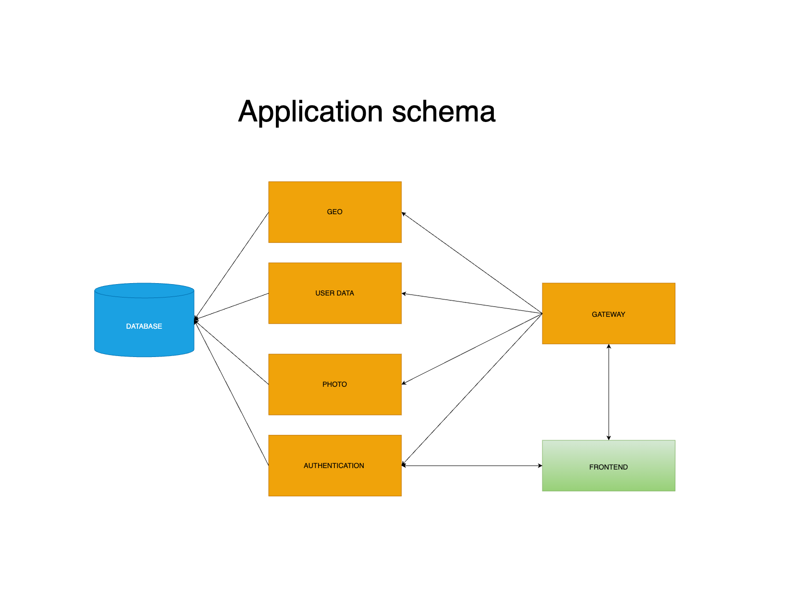
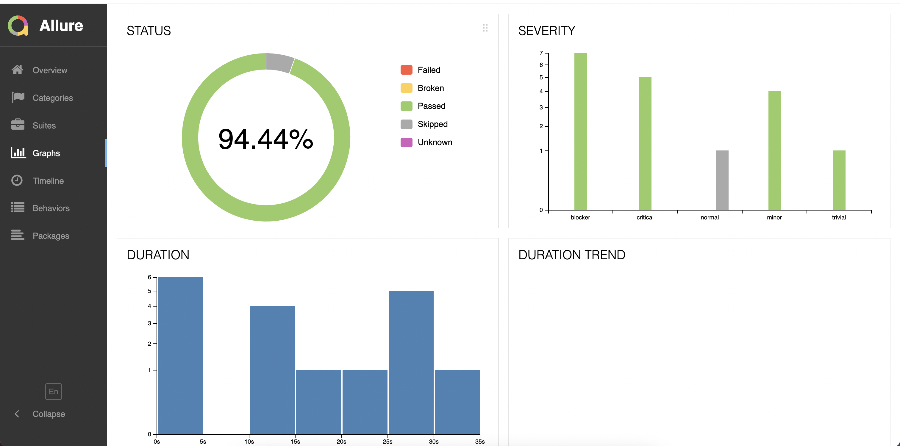
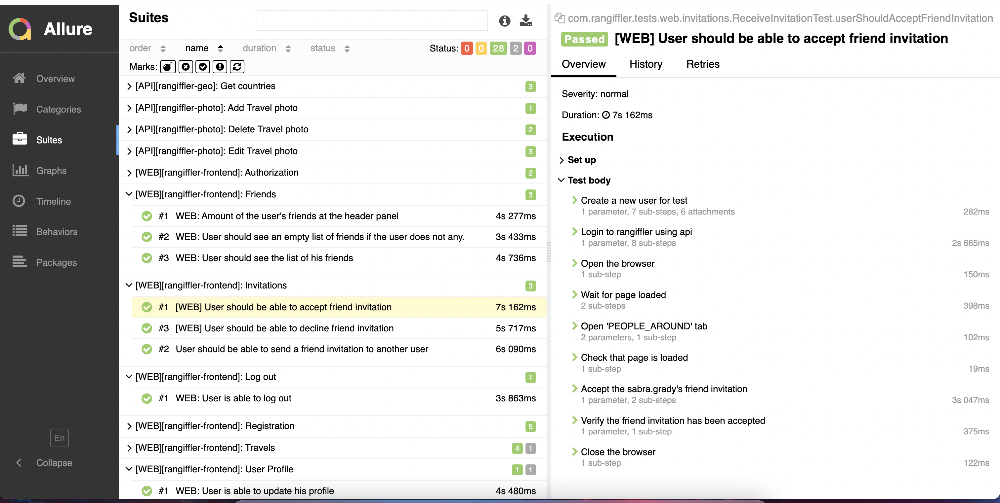

# Rangiffler
  Ladies and Gentlemen allow me to introduce you Rangiffler. Rangiffler - comes from the name of the reindeer.
 This name was chosen for this project because it is all about travel and the reindeer hold the record among deer for the distance traveled on land.
 So, travel and be like Rangifler!

## **Technologies that are used in the project**
### Backend
- [Java 17](https://www.oracle.com/java/technologies/javase/jdk17-archive-downloads.html)
- [Spring Web](https://docs.spring.io/spring-framework/docs/current/reference/html/web.html#spring-web)
- [Spring actuator](https://docs.spring.io/spring-boot/docs/current/reference/html/actuator.html)
- [Spring data JPA](https://spring.io/projects/spring-data-jpa)
- [Spring web-services](https://docs.spring.io/spring-ws/docs/current/reference/html/)
- [Spring Authorization Server](https://spring.io/projects/spring-authorization-server)
- [Spring OAuth 2.0 Resource Server](https://docs.spring.io/spring-security/reference/servlet/oauth2/resource-server/index.html)
### Frontend
- [React](https://ru.reactjs.org/docs/getting-started.html)
- [Nodejs](https://nodejs.dev/en/)
- [Postgres](https://www.postgresql.org/about/)
- [Thymeleaf](https://www.thymeleaf.org/)
### Testing tools
- [Allure](https://docs.qameta.io/allure/)
- [Selenide](https://selenide.org/)
- [Retrofit 2](https://square.github.io/retrofit/)
- [Allure-docker-service](https://github.com/fescobar/allure-docker-service)
- [Selenoid & Selenoid-UI](https://aerokube.com/selenoid/latest/)
- [JUnit 5 (Extensions, Resolvers, etc)](https://junit.org/junit5/docs/current/user-guide/)

### Common tools for building and running the project
- [Docker](https://www.docker.com/resources/what-container/)
- [Intellij Idea](https://www.jetbrains.com/idea/)
- [Gradle 7.6](https://docs.gradle.org/7.6/release-notes.html)
- [Docker-compose](https://docs.docker.com/compose/)


# **Architecture of the application**

The Rangiffler application has been built based on microservices architecture which contains the following service
- Auth - responsible for authentication and authorization 
- Gateway - the proxy service that the frontend uses to communicate with the backend services  
- User data - responsible for providing user data and users' friends information
- Photo - responsible for providing user photo information
- Geo - contains the countries
- Client - front-end interface of the application



#### The list of the components and ports:
| Component | Port |
|-----------|------|
| Database  | 5432 |
| Auth      | 9000 |
| User data | 8089 |
| Gateway   | 8080 |
| Photo     | 8086 |
| Geo       | 8088 |
| Frontend  | 3001 |

**Preconditions for working with the Rangiffler project**

#### 1. Pull the postgres container version 15.1

```posh
docker pull postgres:15.1
```

#### 2. Create volume for saving data from the database in the docker

```posh
docker volume create pgdata
```

#### 3. Run the database

```posh
docker run --name rangiffler-all -p 5432:5432 -e POSTGRES_PASSWORD=secret -v pgdata:/var/lib/postgresql/data -d postgres:15.1
```

#### 4. Install PgAdmin 4 to work with Postgres (Optional step)

#### 5. Connect to the database (host: localhost, port: 5432, user: postgres, password: secret, database name: postgres) using PgAdmin and create empty db for the microservices.

```sql
create database "rangiffler-userdata" with owner postgres;
create database "rangiffler-geo" with owner postgres;
create database "rangiffler-photo" with owner postgres;
create database "rangiffler-auth" with owner postgres;
```

#### 6. Install NPM manager for building the front-end part

[Documentation](https://docs.npmjs.com/downloading-and-installing-node-js-and-npm).
Recommended version Node.js - 18.13.0 (LTS)

# Run Ranigffler locally in your IDE

#### 1. Change directory to rangiffler-client

```posh
MacBook-Pro rangiffler % cd rangiffler-client
```

#### 2. Run front end

```posh
MacBook-Pro rangiffler-client % npm i
MacBook-Pro rangiffler-client % npm run start
```

#### 3. Add run configuration for all the back-end services rangiffler-* - Active profiles 'local'

Open the Run menu -> Edit Configurations -> choose main class -> set Active profiles: local. 

Example can be found on [stackoverflow](https://stackoverflow.com/questions/39738901/how-do-i-activate-a-spring-boot-profile-when-running-from-intellij)

#### 4. Run the Rangiffler-auth service using gradle or the Run command in your  IDE

- Run the auth service

```posh
MacBook-Pro rangiffler % cd rangiffler-auth
MacBook-Pro rangiffler-auth % gradle bootRun --args='--spring.profiles.active=local'
```

#### 5. Run the other services: rangiffler-geo, rangiffler-photo, rangiffler-gateway, rangiffler-userdata

# Run End-to-End tests of the project

#### 1. Change directory to rangiffler-e-2-e-tests

```posh
MacBook-Pro rangiffler % cd rangiffler-client
```

#### 2. Run the test using Gradle wrapper
```posh
./gradlew clean test
```
#### or

#### use the 'run-tests-locally.sh' script
```bash
bash run-tests-locally.sh
```

**By default, it starts in headless and uses 3 threads; however, it's possible to change the number of threads in the ```junit-platform.properties``` file as well as disable the headless ```Configuration.headless = false;```**

```posh
junit.jupiter.execution.parallel.config.fixed.parallelism={threads}
junit.jupiter.execution.parallel.config.fixed.max-pool-size={threads}
```

#### 3. Generate Allure report
**Note: If you run the tests by the bash script the report will be generated and opened automatically.**

**The result of the tests can be viewed through Allure report.**

```posh
./gradlew allureServe
```

### Examples of the test report





